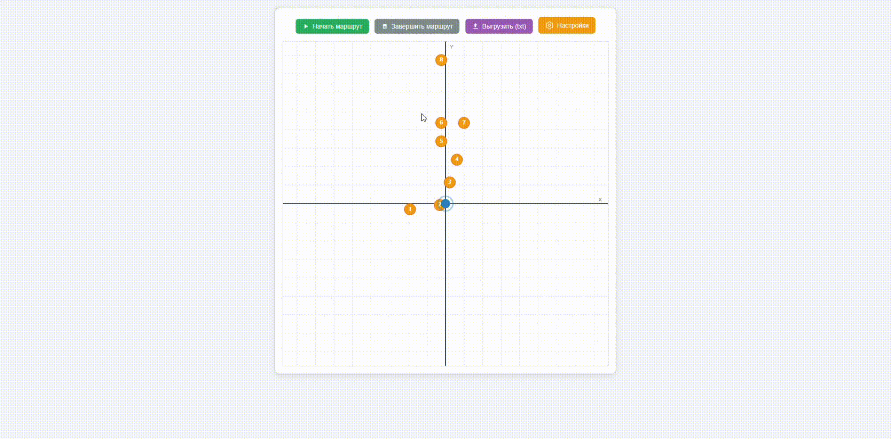
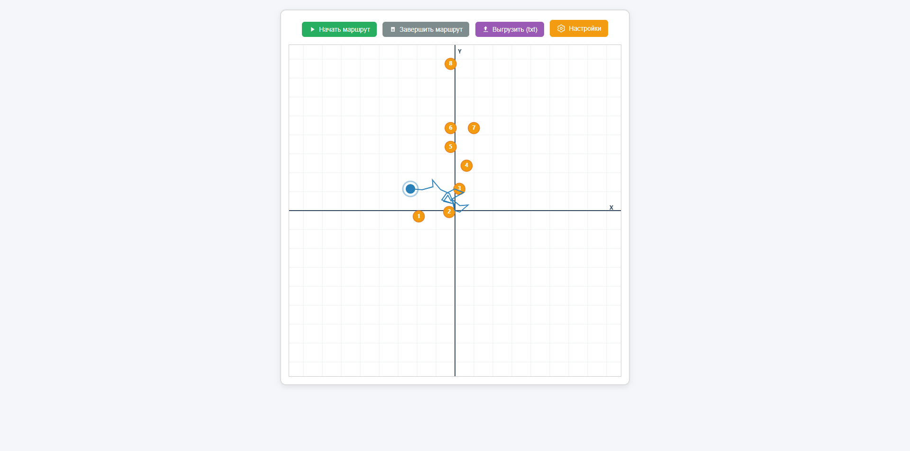
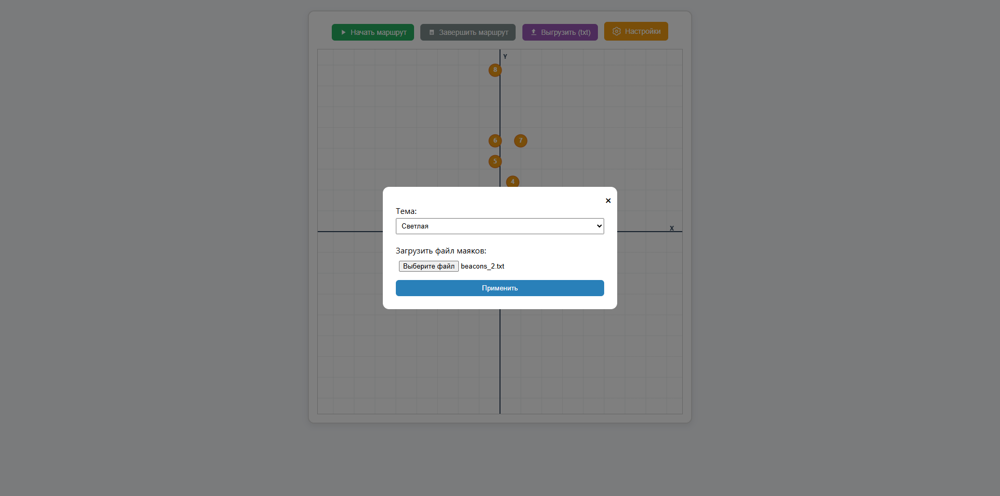

# АКЛ — Indoor Navigation System

---

## Описание

**АКЛ** — это система индор-навигации для построения маршрутов внутри помещений с использованием BLE-технологии. Система позволяет точно определять местоположение пользователя и отображать его на карте здания.

---

## 🎞️ Demo (GIF)

### Demo



---

## 📸 Screenshots (Desktop)

### Главная карта и маршрут



### Управление маячками



---

## 👥 Целевая аудитория

- Студенты университетов — навигация по учебным корпусам, аудиториям и библиотекам

- Посетители и клиенты — торговые центры, бизнес-центры, музеи

- Все, кому нужна точная indoor-навигация

---

## 🧪 Функциональность

- Отображение карты помещения и текущего положения пользователя

- Построение маршрута до выбранной точки

- Работа с BLE-маячками для точного позиционирования

- Адаптивный интерфейс для мобильных устройств и планшетов

- Настройка темы (светлая, тёмная, системная)

- Импорт собственного файла с маячками

- Экспорт маршрута в .txt

---

## 🔧 Техническая реализация

### Оборудование (Hardware)

- Микросхема: ESP32 (приёмник)

- Технология: Bluetooth Low Energy (BLE)

- Питание: USB

- Тип устройства: Мобильное, переносное

### Backend & Software

- Python для взаимодействия с ESP32

- REST API для получения и отправки данных о маршруте и маячках

- Web-клиент с HTML5 Canvas для визуализации карты и маршрута

---

## ⚙️ Установка и запуск

1. Клонируйте репозиторий:

```bash
git clone https://github.com/yourusername/akl.git
cd akl
```

2. Установите зависимости Python:

```bash
pip install -r src/python_test/reqs.txt
```

3. Запустите сервер Python:

```bash
python src/python_test/main.py
```

4. Откройте веб-клиент в браузере (обычно http://localhost:8000)

---

## 💡 Особенности

Система использует сеть BLE-маячков для точного позиционирования внутри зданий, где GPS недоступен. Простое подключение через USB обеспечивает удобство использования без сложной настройки. Поддержка мобильной и планшетной версии делает навигацию удобной в любых условиях.

---

## 🤝 Авторы

| Автор            | Роль        | GitHub/Ссылка                                         | Аватар                                                                                      |
| ---------------- | ----------- | ----------------------------------------------------- | ------------------------------------------------------------------------------------------- |
| Богдан Афанасьев | Разработчик | [Bogdan-Afanasev](https://github.com/Bogdan-Afanasev) |  |
| Илья Манишин     | Разработчик | [IlyaManishin](https://github.com/IlyaManishin)       |    |
| Артём Писарев    | Разработчик | [Artem351](https://github.com/Artem351)               |   |
| Игорь Кругов     | Разработчик | [Igor2569](https://github.com/Igor2569)               |    |

---

## ⚖️ Лицензия

Проект создан в учебных и исследовательских целях. Все использованные API и технологии принадлежат их владельцам. Коммерческое использование без разрешения запрещено.

---

Наслаждайтесь проектом и не забудьте ⭐ звезду, если он был полезен!
